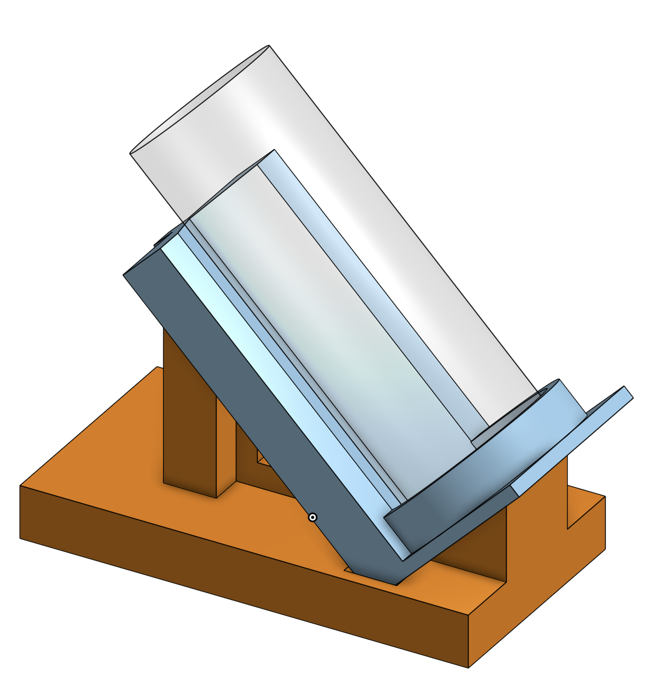

# Robot, I want a beer!
This repository serves as documentation for the "Beer Robot" project in the TUM advanced practical course "Sustainable Process Automation: Humans, Software and the Mediator Pattern".

In the following paragraphs the idea, development artifacts, pre-requirements and the implemented process will be discussed.

# Idea

## Situation before this project
As its name suggests, the Cocktail Robot was previously only able to serve cocktails. However, as people may dislike cocktails or alcoholic drinks in general, the robot lacks the functionality to serve drinks to them. Therefore, adding functionality to let the robot serve drinks from closed, crowned cap bottles widely increases its user base.

## Goal of this project
After successfully implementing this project, the cocktail robot can grab a crown cap bottles, open them, and pour their content into glasses and serve them to a customer. Additionally, the robot will do this in a way, where also foaming baverages (i.e. a beer) can be served with a stable foam crown.

## Process Design
To achieve the above stated project goal, the idea of pouring a drink from a closed crown cap bottle is divided in multiple sub-processes.

### 1. Ordering a drink
At the very beginning of the process stands the user. Over a dedicated website the user is able to place the order and give additional instructions on it. To cover additional use cases the user can state whether the bottle has been open already and also decide if one or two drinks should be made.

The page is fully responsive and can also accessed via a mobile device. To make the ordering process as simple as possible, the link to the webpage can be opened via a QR code placed near the robot.

The webpage for an ordering a drink is avaible under: https://lehre.bpm.in.tum.de/~go56jiw/orderBeer/
Note: In order for the robot to execute the order, the CPEE process needs be started prior to ordering.

The code of the webpage and the PHP files forwarding the user input to the CPEE process engine can be found in this repository in the code folder. 

### 2. Getting the closed bottle
The closed bottle needs to be placed in a predetermined position by a human operator. On process execution, the robot grabs the closed bottle from said position and places it on different position to open it.

### 3. Opening the clossed bottle
In this phase, a special 3D-printed adapter is utilized to hold the bottle opener. This adapter is easy for the robot to hold and push down on the closed bottle to remove the crown cap. 
As the crown can get stuck within the opener, another 3D-printed device might be needed to remove it from the opener.

The CAD construction files for the 3D-printed bottle opener parts can be access via the following link: https://cad.onshape.com/documents/6a5412c4e68d0fce2ab7888f/w/e2a39a63512e6414095e9b9c/e/d7c2ca389113a15bfc2ea8c5?renderMode=0&uiState=66e17026db572617a75261e5

### 4. Pouring the drink
The carbonation of bevarages can cause them to heavily foam when pouring straight down into a glass. To ensure a steady flow without major foam producation the glass is placed on a special 3D-printed slope in a 45° angle first.

After filling the most of the glass on the holding device, the robot returns glass to its inital position. Subsequently, the robot grabs the opened bottle again and pours a small amount into the glass to create some foam right before serving.

As one bottle holds enough liquid the serve two drinks at a time, the customer can also order two drinks at once. In this case both glasses are filled on the sloped successively and then "foamed up" in the same movement afterwards.

The CAD construction files for the 3D-printed glass holder parts can be access via the following link: https://cad.onshape.com/documents/83273c00850ef1c1cad62c91/w/5cc8dd61ae3197134bb7c1b9/e/b5ddfee44e0f972412c45bbc?renderMode=0&uiState=66e173128ab39f00f015a33b

### 5. Serving the drink 
In the current process implementation, the user placed one or two glasses in predetermined positions. The robot the takes the glasses from there, moves them on the slope and returns them to the inital positions to "foam up" and serve the drinks.

# Executing the program

## Inital positioning
To ensure a correct program execution, all items should be placed as shown on the following picture:

## Starting the CPEE process
The CPEE program for this project can be found under
[`Teaching/Prak/TUM-Prak-24-SS/TGeilenBier/RobotIWantABeer.xml`](https://cpee.org/hub/?stage=development&dir=Teaching.dir/Prak.dir/TUM-Prak-24-SS.dir/TGeilenBier.dir/)

The process is designed to wait for an order after being started. This is implemented by calling a php file, waiting for changes in the files `numOfBeers.txt` and `openRequired.txt`. When both of these are changed, the new values stored in them are returned to the CPEE and saved in local variables.

## Ordering on the webpage
As described above, the customers are able to order their drinks via a dedicated webpage `orderBeer/index.php`.

When clicken on the "Order now" button, the user input is saved to the `numOfBeers.txt` and `openRequired.txt` files, triggering the continuation of the CPEE process.

Afterwards, the customer is customer is forwarded to the page `orderBeer/orderPlaced.php`, which shows the remaining time until the order is finished.

## Preperation of drinks
Based on the user input provided via the webpage, the CPEE calls different endpoints of the robot. The following table shows all available programs and endpoints:

| Program Name       | Endpoint URL                  |
|--------------------|-------------------------------|
| getOrder          | `https://lehre.bpm.in.tum.de/~go56jiw/getOrder.php`                  |
| placeBottle          | `https://lab.bpm.in.tum.de/ur/programs/TGeilenBier/grabBottlePutOpenSpot.urp/wait`                  |
| openBottle          | `https://lab.bpm.in.tum.de/ur/programs/TGeilenBier/grabOpenRelease.urp/wait`                  |
| placeG1OnSlope          | `https://lab.bpm.in.tum.de/ur/programs/TGeilenBier/placeG10nSlope.urp/wait`                  |
| removeG1FromSlope          | `https://lab.bpm.in.tum.de/ur/programs/TGeilenBier/removeG2FromSlope.urp/wait`                  |
| placeG2OnSlope          | `https://lab.bpm.in.tum.de/ur/programs/TGeilenBier/placeG10nSlope.urp/wait`                  |
| removeG2FromSlope          | `https://lab.bpm.in.tum.de/ur/programs/TGeilenBier/removeG2FromSlope.urp/wait`                  |
| pourDrinkOnSlope         | `https://lab.bpm.in.tum.de/ur/programs/TGeilenBier/pourDrinkOnSlope.urp/wait`                  |
| foamUp1Drink          | `https://lab.bpm.in.tum.de/ur/programs/TGeilenBier/foamUp1Drink.urp/wait`                  |
| foamUp2Drinks          | `https://lab.bpm.in.tum.de/ur/programs/TGeilenBier/foamUp2Drinks.urp/wait`                  |
| returnBottle         | `https://lab.bpm.in.tum.de/ur/programs/TGeilenBier/returnBottle.urp/wait`                  |

## Serving the order
After the 60% of the process has been completed, the customer is informed on the webpage to come back to the bar.

After the execution has finished, an alert is shown on the customers webpage, stating that the order is done.

The glass can safely be picked up from their initial spots.