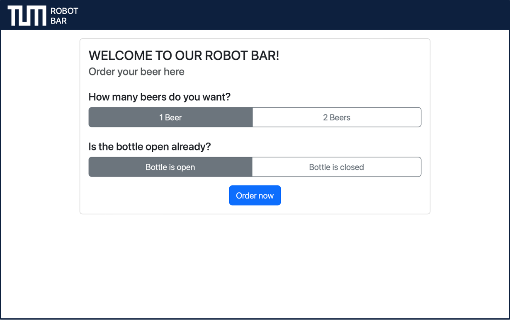
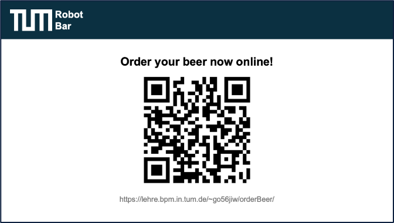

# Robot, I Want a Beer!
This repository serves as documentation for the "Beer Robot" project in the TUM advanced practical course "Sustainable Process Automation: Humans, Software, and the Mediator Pattern".

In the following paragraphs, the idea, development artifacts, prerequisites, and the implemented process will be discussed.

# Idea

## Situation Before This Project
As its name suggests, the Cocktail Robot was previously only able to serve cocktails. However, as some people may dislike cocktails or alcoholic drinks in general, the robot lacked the functionality to serve other drinks. Therefore, adding the ability to let the robot serve drinks from closed, crown-capped bottles greatly increases its user base.

## Goal of This Project
After successfully implementing this project, the cocktail robot can grab crown-capped bottles, open them, pour their contents into glasses, and serve them to a customer. Additionally, the robot will do this in a way that ensures foaming beverages (i.e., beer) can be served with a stable foam head.

## Process Design
To achieve the above-stated project goal, the process of pouring a drink from a closed, crown-capped bottle is divided into multiple subprocesses.

### 1. Ordering a Drink
The process begins with the user. Through a dedicated website, the user can place an order and provide additional instructions. To cover extra use cases, the user can specify whether the bottle has already been opened and decide if one or two drinks should be made.

The page is fully responsive and can be accessed via a mobile device. To simplify the ordering process, the link to the webpage can be opened via a QR code placed near the robot.

The webpage for ordering a drink is available at: https://lehre.bpm.in.tum.de/~go56jiw/orderBeer/

**Note:** For the robot to execute the order, the CPEE process needs to be started before ordering.

The code for the webpage and the PHP files that forward user input to the CPEE process engine can be found in this repository in the "code" folder.

### 2. Getting the Closed Bottle
The closed bottle needs to be placed in a predetermined position by a human operator. During process execution, the robot grabs the closed bottle from this position and places it in a different location to open it.

### 3. Opening the Closed Bottle
In this phase, a special 3D-printed adapter is used to hold the bottle opener. This adapter is easy for the robot to hold and press down on to remove the crown cap from the closed bottle. As the cap can get stuck within the opener, another 3D-printed device might be needed to remove it.

The CAD construction files for the 3D-printed bottle opener parts can be accessed via the following link: https://cad.onshape.com/documents/6a5412c4e68d0fce2ab7888f/w/e2a39a63512e6414095e9b9c/e/d7c2ca389113a15bfc2ea8c5?renderMode=0&uiState=66e17026db572617a75261e5

### 4. Pouring the Drink
The carbonation of beverages can cause them to foam heavily when poured straight into a glass. To ensure a steady flow without excessive foam production, the glass is first placed on a special 3D-printed slope at a 45° angle.

After filling most of the glass on the holding device, the robot returns the glass to its initial position. The robot then grabs the opened bottle again and pours a small amount into the glass to create a foam head before serving.

As one bottle holds enough liquid for two drinks, the customer can order two drinks at once. In this case, both glasses are filled successively on the slope and "foamed up" afterward.

The CAD construction files for the 3D-printed glass holder parts can be accessed via the following link: https://cad.onshape.com/documents/83273c00850ef1c1cad62c91/w/5cc8dd61ae3197134bb7c1b9/e/b5ddfee44e0f972412c45bbc?renderMode=0&uiState=66e173128ab39f00f015a33b

### 5. Serving the Drink
In the current process implementation, the user places one or two glasses in predetermined positions. The robot then takes the glasses, moves them onto the slope, and returns them to their initial positions to "foam up" and serve the drinks.

# Executing the Program

## Initial Positioning
To ensure correct program execution, all items should be placed as shown in the following picture:

## Starting the CPEE Process
The CPEE program for this project can be found under:
[`Teaching/Prak/TUM-Prak-24-SS/TGeilenBier/RobotIWantABeer.xml`](https://cpee.org/hub/?stage=development&dir=Teaching.dir/Prak.dir/TUM-Prak-24-SS.dir/TGeilenBier.dir/)

The process is designed to wait for an order after being started. This is implemented by calling a PHP file that waits for changes in the `numOfBeers.txt` and `openRequired.txt` files. When both of these files are updated, the new values stored in them are returned to the CPEE and saved in local variables.

## Ordering on the Webpage
As described above, customers can order their drinks via the dedicated webpage `orderBeer/index.php`.

When the "Order Now" button is clicked, the user input is saved to the `numOfBeers.txt` and `openRequired.txt` files, triggering the continuation of the CPEE process.

Afterward, the customer is forwarded to the page `orderBeer/orderPlaced.php`, which displays the remaining time until the order is complete.

## Preparation of Drinks
Based on the user input provided via the webpage, the CPEE calls different endpoints of the robot. The following table shows all available programs and endpoints:

| Program Name       | Endpoint URL                  |
|--------------------|-------------------------------|
| getOrder           | `https://lehre.bpm.in.tum.de/~go56jiw/getOrder.php`                  |
| placeBottle        | `https://lab.bpm.in.tum.de/ur/programs/TGeilenBier/grabBottlePutOpenSpot.urp/wait`                  |
| openBottle         | `https://lab.bpm.in.tum.de/ur/programs/TGeilenBier/grabOpenRelease.urp/wait`                  |
| placeG1OnSlope     | `https://lab.bpm.in.tum.de/ur/programs/TGeilenBier/placeG10nSlope.urp/wait`                  |
| removeG1FromSlope  | `https://lab.bpm.in.tum.de/ur/programs/TGeilenBier/removeG2FromSlope.urp/wait`                  |
| placeG2OnSlope     | `https://lab.bpm.in.tum.de/ur/programs/TGeilenBier/placeG10nSlope.urp/wait`                  |
| removeG2FromSlope  | `https://lab.bpm.in.tum.de/ur/programs/TGeilenBier/removeG2FromSlope.urp/wait`                  |
| pourDrinkOnSlope   | `https://lab.bpm.in.tum.de/ur/programs/TGeilenBier/pourDrinkOnSlope.urp/wait`                  |
| foamUp1Drink       | `https://lab.bpm.in.tum.de/ur/programs/TGeilenBier/foamUp1Drink.urp/wait`                  |
| foamUp2Drinks      | `https://lab.bpm.in.tum.de/ur/programs/TGeilenBier/foamUp2Drinks.urp/wait`                  |
| returnBottle       | `https://lab.bpm.in.tum.de/ur/programs/TGeilenBier/returnBottle.urp/wait`                  |

## Serving the Order
Once 60% of the process is complete, the customer is informed via the webpage to return to the bar.

After the execution finishes, an alert is displayed on the customer's webpage, indicating that the order is ready.

The glasses can then be safely picked up from their initial spots.

## Demo
The video below showcases the execution of the program for one drink with a closed bottle. *(Note: The video speed is increased by 4x)*

## Execution Times
Depending on the number of drinks and whether the bottle is open or closed, the execution time varies. The following table shows the times for each combination:

|                | 1 Drink | 2 Drinks |
|----------------|---------|----------|
| Open bottle    |  1:44   |   2:17   |
| Closed bottle  |  2:40   |   3:13   |

The provided execution times were measured manually and may vary slightly.

---
